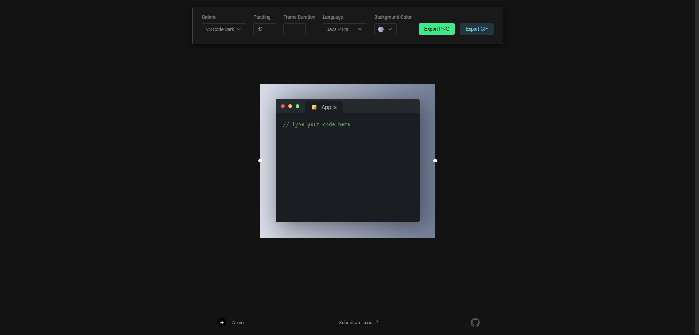

 

  

  <h3 align="center">Aizen</h3>

  

    <strong>Awesome gifs and images of your code</strong>
  

### Demo

### Built With

* [React.js](https://reactjs.org/)
* [DOM to Image](https://github.com/tsayen/dom-to-image)
* [GIFshot](https://yahoo.github.io/gifshot/)

<!-- LICENSE -->
## License

Distributed under the MIT License. See [LICENSE](./LICENSE) for more information.